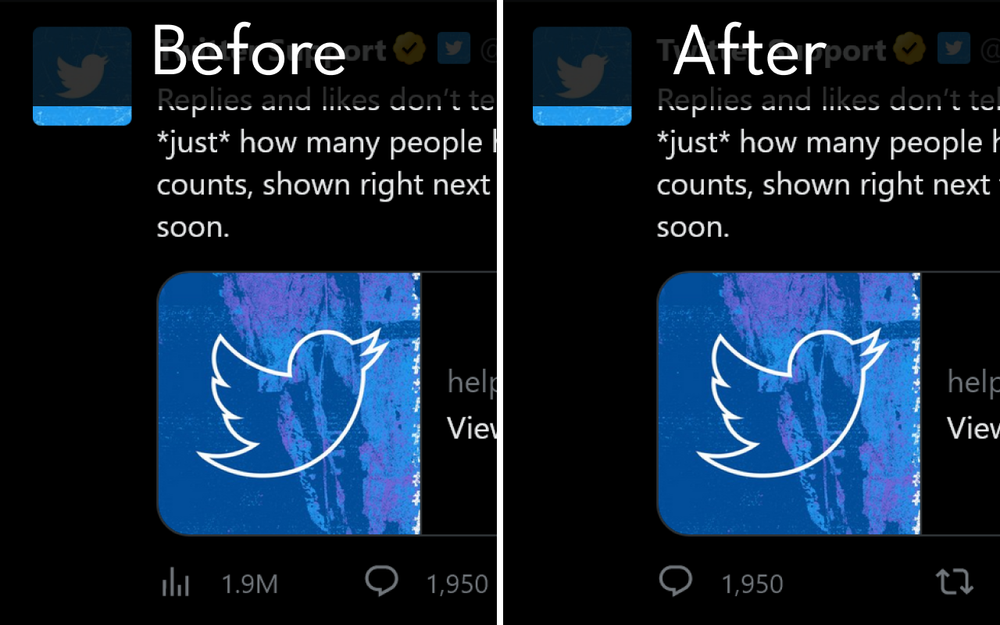

# Hide View Count


[日本語で読む](README_ja.md)

This extension hides the number of impressions on Twitter and prevents the creation of an approval desire monster. It won't allow the View Count to be displayed for even a second!

This is an extension to "not **see** the number of impressions". It cannot be used to "not **show** the number of impressions".

- Chrome：[https://chrome.google.com/webstore/detail/hide-view-count/mmefeobjcchickbjelledfhagoddcklp](https://chrome.google.com/webstore/detail/hide-view-count/mmefeobjcchickbjelledfhagoddcklp)
- Firefox：[https://addons.mozilla.org/firefox/addon/hide-view-count/](https://addons.mozilla.org/firefox/addon/hide-view-count/)



## What you can do

- Hide the number of impressions of your tweets and others' tweets on your browser

## What you cannot do

- Hide the number of impressions of your Tweets from others
- Using a client other than the official web version of the Twitter client

## Supported Browsers

- Google Chrome: Supported
- Mozilla Firefox: Supported
- Microsoft Edge: Supported
- Opera: Unsupported but user report says it works

## Development

### Setup

```powershell
npm install
```

### Build

```powershell
npm build
```

*Both Manifest v2 (for Firefox) and Manifest v3 (for Chrome) files are generated in the following locations

- Manifest v2: ``web-ext-artifacts/manifest_v2/hide_view_count-<VERSION>.zip``
- Manifest v3: ``web-ext-artifacts/manifest_v3/hide_view_count-<VERSION>.zip``

### Manifest

The v2 and v3 manifest files are ``manifest/v2.json`` and ``manifest/v3.json`` respectively.

At build time, these files are copied to generate ``manifest.json``. v2 and v3 are built at the same time, but the v2 Manifest file is copied during the v2 build phase and the v3 Manifest file during the v3 build phase.

### Versioning

Follows normal semantic versioning. Use the ``npm version`` command to update the version number.

Also, the version number of the extension listed in the manifest file is overwritten by the version number listed in ``package.json``. Therefore, there is no need to edit the version number in the manifest file when updating the version number.
